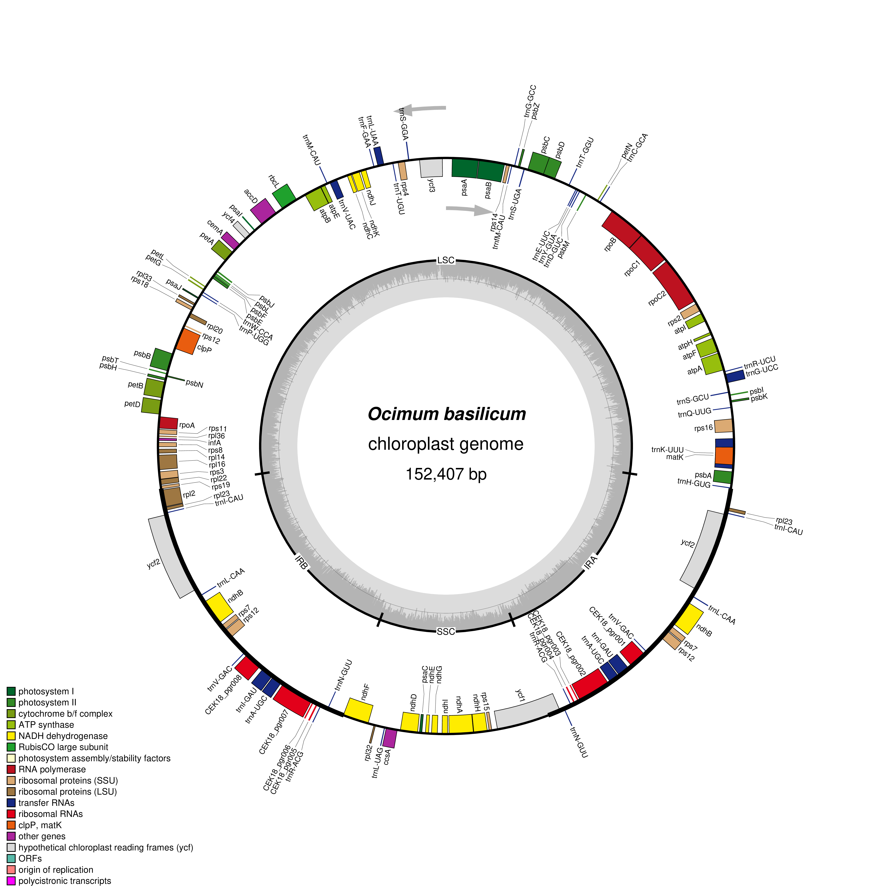

# Visualize Plastid Genome Structure

**Name:** Ann Marielle U.Dael
**Scientific name:** *Ocimum basilicum*  
**Accession:** NC_035143.1  
**Genome length:** 152,407 bp  

## Activity Overview

This activity focuses on visualizing and examining the structure and organization of the *Ocimum basilicum* plastid genome. The same plastid genome used in the previous activity was used to create a graphical plastid genome map.

The plastid genome was obtained from NCBI using accession NC_035143.1, which represents the complete chloroplast genome of *Ocimum basilicum*.

## Data Source

**Source:** NCBI Nucleotide  
**Accession:** NC_035143.1  
**Organism:** *Ocimum basilicum*  
**Genome:** Chloroplast, complete genome  
**Genome length:** 152,407 bp  
**Topology:** Circular  

The annotated GenBank file used for the visualization is stored in the `data/` folder:

`data/Ocimum_basilicum_NC_035143.1.gb`

## OGDRAW Visualization

The plastid genome map was generated using OGDRAW (OrganellarGenomeDRAW).

OGDRAW: https://chlorobox.mpimp-golm.mpg.de/OGDraw.html

### OGDRAW Settings

The following settings were used:

- **Map type:** Standard
- **Genome type:** Plastid
- **Map shape:** Circular
- **Inverted repeat detection:** Auto
- **Draw GC content graph:** Enabled
- **Show direction of transcription:** Enabled
- **Show full legend:** Enabled
- **Label intron-containing genes with `*`:** Enabled
- **Output format:** PNG
- **Resolution:** Fine

## Plastid Genome Map



**Figure 1.** *Graphical map of the *Ocimum basilicum* chloroplast genome generated using OGDRAW.*

## Structural Features

The *Ocimum basilicum* plastid genome has a circular structure with the typical quadripartite organization of a plastid genome. The map shows a LSC region, SSC region, and the IRa and IRb regions. The LSC occupies the largest portion of the genome, while the SSC is smaller. The two inverted repeat regions are located between the LSC and SSC regions. The map also shows protein-coding genes, transfer RNA genes, ribosomal RNA genes, gene transcription directions, and the GC content pattern across the genome. Genes located within the inverted repeats can appear more than once because the IR regions are duplicated.

## Answers

The answers to Questions 1–10 are available in:

[`answers/Lab_plastid_genome_answers.md`](answers/Lab_plastid_genome_answers.md)


## Repository Structure

```text
Lab_Plastid_Genome_Visualization/
├── README.md
├── data/
│   └── Ocimum_basilicum_NC_035143.1.gb
├── figures/
│   └── Ocimum_basilicum_plastid_map.png
└── answers/
    └── Lab_plastid_genome_answers.md
